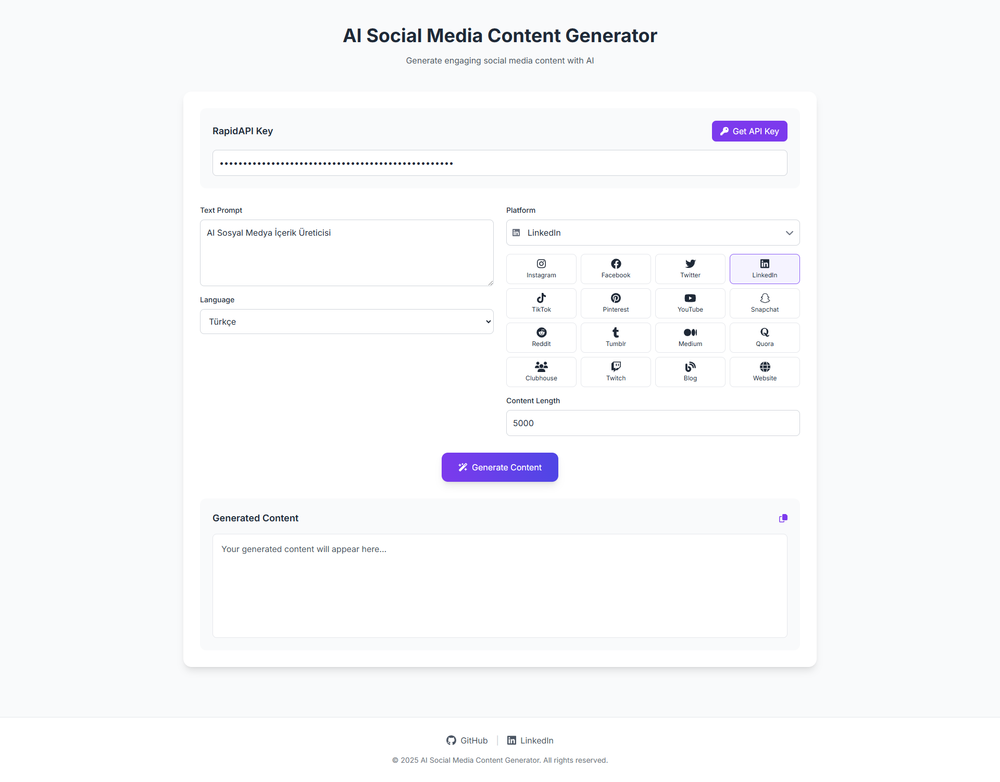

# AI Social Media Content Generator

Generate engaging social media content with AI for multiple platforms. Create viral posts for Instagram, Facebook, Twitter, LinkedIn, and more.

## 🌟 Features 

- 🚀 Multi-platform content generation
- 🌍 25+ language support
- 📏 Customizable content length
- 🎯 Viral content optimization
- ⚡ Real-time content generation
- 📱 Platform-specific formatting

## 🎯 Supported Platforms

- Instagram
- Facebook
- Twitter
- LinkedIn
- TikTok
- Pinterest
- YouTube
- Snapchat
- Reddit
- Tumblr
- Medium
- Quora
- Clubhouse
- Twitch
- Blog
- Website

## 🌍 Supported Languages

- Turkish (Türkçe)
- English
- Spanish (Español)
- French (Français)
- German (Deutsch)
- Italian (Italiano)
- Portuguese (Português)
- Russian (Русский)
- Japanese (日本語)
- Korean (한국어)
- Chinese (中文)
- Arabic (العربية)
- Hindi (हिन्दी)
- And many more...

## 🚀 Getting Started

1. Visit [AI Social Media Content Generator](https://ai-social-media-content-generator.projelerim.tr)
2. Get your RapidAPI key from [RapidAPI](https://rapidapi.com/ltdbilgisam/api/ai-social-media-content-generator-viral-content-creator)
3. Enter your API key
4. Write your content prompt
5. Select target platform and language
6. Set desired content length
7. Click "Generate Content"

## 💻 Technical Details

- Built with modern web technologies
- Responsive design
- State management with URL persistence
- Real-time content generation
- Cross-platform compatibility

## 🔑 API Integration

The application uses RapidAPI for content generation. You'll need to:
1. Sign up at RapidAPI
2. Subscribe to the AI Social Media Content Generator API
3. Get your API key
4. Use the key in the application
